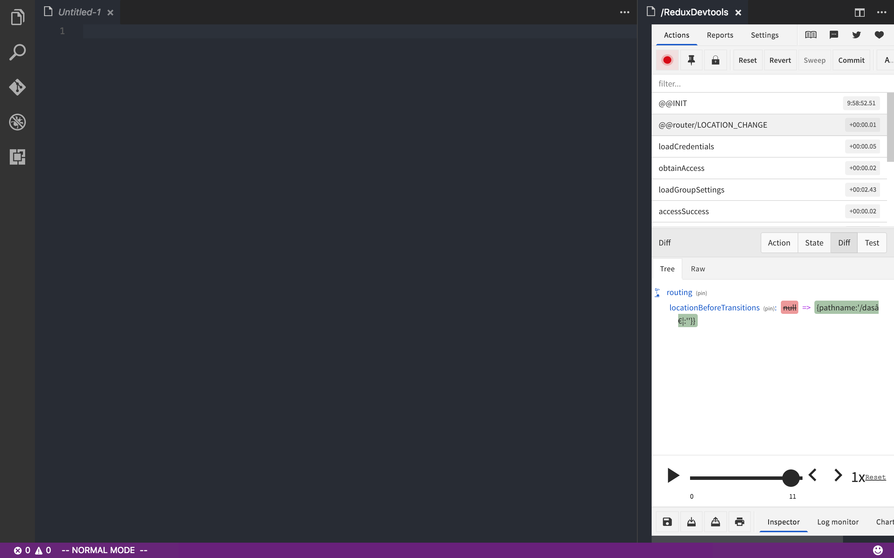

# Redux DevTools for VSCode

Visual Studio Code extension to include remotedev-app into editor.

Due to limition of vscode extension api, this extension need to load external resources. That means this extension will **only work with Internet connected**.

> Please note that this is an expiremental extension for now, contains several known issues. 
>
> No guarantees until official beta version release, but you are welcome to take a shot.

## Features

Inspect redux actions for your redux app. Like the one you may use in Chrome.



## Quick Start

* Install the extension

* `cmd+shift+P` to open **Command Palette** and type in `Redux Devtools`, select command `Open in the Side`.

* In devtool pannel, click settings to set listening port and host to your remotedev server.

* Optional, if you don't have an remotedev server running, you may want to write some script to start one. Here is an example:

  ```javascript
  const remotedev = require('remotedev-server');

  remotedev({
      hostname: '127.0.0.1',
      port: 1024,
  });
  ```

  (After that you can follow step 3 to set your local host and port)

* Additionally, you also need to compose remote redux devtool middleware into your redux store:

  ```javascript
  import {createStore, applyMiddleware} from 'redux';
  import {composeWithDevTools} from 'remote-redux-devtools';

  let composeEnhancers = composeWithDevTools({
      realtime: true,
      name: 'Your Instance Name',
      host: '127.0.0.1',
      port: 1024, // the port your remotedev server is running at
  });

  const store = createStore(
      yourReducer,
      composeEnhancers(
          applyMiddleware(...)
      )
  );
  ```

  ​

## Extension Settings

Redux Devtools contributes the following settings:

> Note that these settings are used to create the remotedev-app instance.
> You can also set these properties simplly by click `settings` in the top of the devtool.
> Remotedev-app would try to persist your settings, and it has higher priority than vscode configurations.
> We are using a beta version of remotedev-app, all of these behaviors may change in the future.

* `reduxdev.hostname`: The hostname your remotedev server started on.
* `reduxdev.socketPort`: The socket port for Redux Devtools to listen. 

## Release Notes

## Known Issues

* monitor icon not display correctly
* ~~click event not handled in Inspector select and Settings dialog, [#31](https://github.com/zalmoxisus/remotedev-app/issues/31)~~

## License
MIT

*powered by remotedev-app.*
